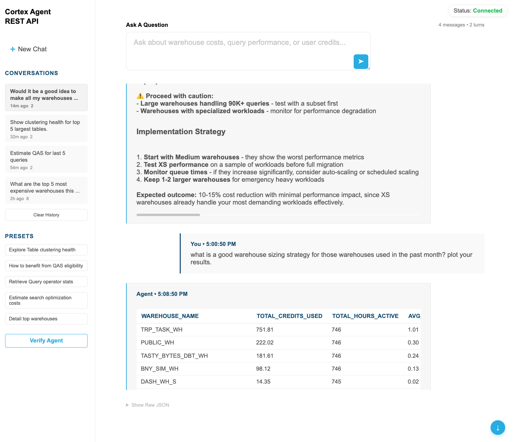

# Update: 11/10/25 - Now deployable in SPCS! See `docs/SPCS_DEPLOYMENT.md` and `deploy.sql` 


# Snowflake Cortex Agent REST API Client

A lightweight, configurable web application for interacting with Snowflake Cortex Agents via REST API. Built for easy customization and sharing with coworkers.



Reference: [Cortex Agents Run API](https://docs.snowflake.com/en/user-guide/snowflake-cortex/cortex-agents-run)

---

## Overview

This application provides a clean, minimal web interface for interacting with any Snowflake Cortex Agent. It acts as a bridge between browser and Snowflake's REST API, handling authentication securely on the backend while providing an intuitive chat-like interface.

**✨ Key Features:**
- **Modern minimalist UI** - Clean, airy design with all-white backgrounds and strategic blue accents
- **Chat-style interface** - Natural conversation flow with message bubbles (like ChatGPT/Claude)
- **Fully configurable** - UI branding, presets, and storage limits via `public/config.json`; Snowflake agent connection via backend `.env`
- **Secure** - PAT token stored in backend `.env`, never exposed to browser
- **Multi-turn conversations** - Maintains context with full conversation history
- **Conversation history** - Shows 5 most recent chats in sidebar with text wrapping
- **Rich rendering** - Markdown headings, formatted text, data tables (with scroll hints), and interactive Vega-Lite charts
- **SQL that reads beautifully** - Highlight.js syntax highlighting plus preserved multiline formatting for agent SQL/code blocks
- **Configurable history retention** - Tune max saved conversations/messages to keep localStorage in check
- **Dynamic feedback** - Rotating thinking messages ("Querying Snowflake...", "Processing results...", etc.)
- **Keyboard shortcuts** - Press Enter to send, Shift+Enter for new line
- **Instant display** - User messages appear immediately while agent processes
- **Shareable** - Coworkers only update `backend/.env` and `public/config.json`, no code changes needed
- **Brand customizable** - Custom app title for white-labeling (e.g., "Acme Corp AI Assistant")

---

## Quick Start

**Prerequisites:** Node.js 18+, Snowflake account with a Cortex Agent, and a Personal Access Token (PAT).

**First time setup?** See [DEPLOYMENT.md](./DEPLOYMENT.md) for complete instructions on creating your agent, generating a PAT, and initial configuration.

### Local Deployment (Development & Testing)

**Already configured?** Just run:

1. **Configure `backend/.env`** with Snowflake credentials + agent name:
   ```bash
   SNOWFLAKE_ACCOUNT_URL=https://your-account.snowflakecomputing.com
   AGENT_NAME=YOUR_AGENT_NAME
   AGENT_DB=YOUR_DATABASE
   AGENT_SCHEMA=YOUR_SCHEMA
   WAREHOUSE=YOUR_WAREHOUSE
   AUTH_TOKEN=sf-pat-your-token-here
   ```

2. **(Optional) Customize `public/config.json`** for branding, presets, and storage limits

3. **Install and start:**
   ```bash
   cd backend
   npm install
   npm start
   ```

4. **Open browser:** `http://localhost:5173`

5. **Use the app:** Press Enter to send questions, Shift+Enter for multi-line

### Snowpark Container Services Deployment (Production)

Deploy as a managed containerized service directly within Snowflake:

- **✅ No external infrastructure** - Runs entirely in your Snowflake account
- **✅ Public HTTPS endpoint** - Accessible from anywhere with a Snowflake-managed URL
- **✅ Auto-scaling** - Scales from 1-3 nodes based on load
- **✅ Cost-efficient** - Auto-suspends after inactivity

**Quick Deploy:**

1. Build and push Docker image (see [SPCS_DEPLOYMENT.md](./docs/SPCS_DEPLOYMENT.md) for details)
2. Execute `deploy.sql` in Snowflake to create the service

**📘 Full Guide:** See [docs/SPCS_DEPLOYMENT.md](./docs/SPCS_DEPLOYMENT.md) for comprehensive step-by-step instructions, troubleshooting, and cost optimization.

---

## Architecture

```
┌─────────────────┐
│   Browser UI    │  ← User asks questions
│  (Static HTML)  │     Conversations stored in localStorage
└────────┬────────┘
         │ HTTP
         ↓
┌─────────────────┐
│  Express Proxy  │  ← Handles auth, calls Snowflake REST API
│   (Node.js)     │     Tracks thread_id & parent_message_id
└────────┬────────┘
         │ HTTPS + PAT Token
         ↓
┌─────────────────────────────────────────┐
│         Snowflake Cloud                 │
│  ┌──────────────────────────────────┐   │
│  │     Your Cortex Agent            │   │
│  │  - Orchestrates tools            │   │
│  │  - Cortex Analyst (optional)     │   │
│  │  - Stored procedures (optional)  │   │
│  │  - Cortex Search (optional)      │   │
│  └──────────────────────────────────┘   │
└─────────────────────────────────────────┘
```

---

## Project Structure

```
Cortex_REST_API_Client/
├── backend/
│   ├── package.json          # Node dependencies (express, cors, dotenv)
│   ├── server.js             # Express proxy with REST API routes
│   └── .env                  # Server config (NOT in git)
│
├── public/
│   ├── index.html            # Minimalist UI with sidebar navigation
│   ├── styles.css            # All-white design with Snowflake Blue accents
│   ├── app.js                # Frontend logic (conversations, dynamic feedback)
│   ├── config.json           # UI preferences (branding, presets, storage limits)
│   ├── config.example.json   # Example config template
│   └── snow_sage1.png        # Logo image (optional)
│
├── docs/
│   ├── CONFIG_CUSTOMIZATION.md  # Advanced configuration guide
│   ├── SPCS_DEPLOYMENT.md       # Snowpark Container Services deployment guide
│   ├── TESTING.md               # Testing instructions
│   └── archive/                 # Version notes and summaries
│
├── images/
│   └── example.png           # Screenshot of the application
│
├── Dockerfile                # Container image definition for SPCS
├── .dockerignore             # Docker build exclusions
├── service-spec.yaml         # SPCS service specification
├── deploy.sql                # SQL script to create SPCS resources
│
├── README.md                 # This file
├── DEPLOYMENT.md             # Local setup and deployment guide
└── CHANGELOG.md              # Version history
```

---

## Tech Stack

**Backend:**
- Node.js 18+ with ES modules
- Express (minimal web server + proxy)
- dotenv (environment config)
- cors (enable cross-origin requests)

**Frontend:**
- Vanilla HTML/CSS/JavaScript (no framework, no build step)
- Server-sent events parsing for agent streaming responses
- localStorage for conversation persistence
- Vega-Lite for interactive charts

**Snowflake:**
- Cortex Agents (Preview feature)
- REST API with PAT authentication
- Any agent tools you've configured (Analyst, Search, stored procedures, etc.)

---

## Key Files Explained

### `backend/server.js`

Minimal Express proxy that:
- Serves static files from `public/`
- Exposes REST routes that forward to Snowflake
- Handles authentication (PAT token stored in `.env`)
- Parses streaming server-sent events from agent:run
- Tracks thread_id and parent_message_id for multi-turn conversations

**Routes:**
- `GET /api/health` — Returns config status (checks for missing env vars)
- `GET /api/app-config` — Returns merged backend/UI configuration for the frontend
- `GET /api/agent/:name/describe` — Describes an agent (verifies it exists)
- `POST /api/agent/:name/run` — **Main endpoint**: calls agent:run and parses streaming response

### `public/index.html`

Clean, minimalist UI with:
- **All-white design** with strategic Snowflake Blue accents
- **Customizable branding** - configurable app title (default: "Cortex Agent REST API")
- **Status indicator** (top-right) showing connection state with success green color
- **Left sidebar (320px)** - white background with subtle borders
  - Conversation history (5 most recent, with text wrapping)
  - Preset question buttons
  - "Verify Agent" ghost button (blue outline)
- **Main content area** - wide, airy layout (max 1600px)
  - Dynamic greeting ("Good morning/afternoon/evening")
  - Question input with inline send button
  - Chat message display (user right, agent left)
  - Message bubbles with light backgrounds and colored left borders
  - Rotating thinking indicator ("Agent is thinking...", "Querying Snowflake...", etc.)
  - Auto-scroll with floating button
  - Tables with visible scrollbars and shadow hints
- **Keyboard shortcuts** - Enter to send, Shift+Enter for new line
- **Subdued debug view** - "Show Raw JSON" (subtle, reveals on hover)

### `public/app.js`

Frontend logic:
- Auto-checks health on page load
- Loads configuration from `/api/app-config` (environment + UI merge)
- Manages conversation history in localStorage (shows 5 most recent)
- Full conversation history sent to agent for context (not just thread IDs)
- Chat-style message rendering with animated thinking indicator
- Dynamic thinking messages that rotate every 8 seconds
- Auto-scroll to latest message with floating scroll button
- Keyboard shortcuts (Enter to send, Shift+Enter for new line)
- Renders responses with markdown, tables (with scroll hints), highlight.js SQL blocks, and Vega-Lite charts
- Instant user message display for immediate feedback
- Updates status indicator with success green color
- Thread indicator shows message count and conversation turns
- Configurable storage pruning (max conversations/messages) with automatic cleanup when limits are exceeded

### `public/config.json`

User-facing configuration (UI only):
```json
{
  "appTitle": "Cortex Agent<br>REST API",
  "maxConversations": 10,
  "maxMessagesPerConversation": 10,
  "presets": [
    {
      "label": "Example question",
      "prompt": "What can you help me with?"
    }
  ]
}
```

**Customization:**
- `appTitle`: Custom branding text (HTML allowed, use `<br>` for line breaks)
  - Default: "Cortex Agent<br>REST API"
  - Example: "Acme Corp<br>AI Assistant" for white-labeling
- `maxConversations`: Max number of conversations to keep in localStorage before pruning (default `10`)
- `maxMessagesPerConversation`: Max messages retained per conversation for context (default `10`)
- `presets`: Array of preset questions
  - `label`: Button text shown in UI
  - `prompt`: Question text sent to agent when clicked

Snowflake connection settings (`SNOWFLAKE_ACCOUNT_URL`, `AGENT_NAME`, `AGENT_DB`, `AGENT_SCHEMA`, `WAREHOUSE`, `AUTH_TOKEN`) now live exclusively in `backend/.env`. The frontend consumes a merged payload from `/api/app-config` so those values never ship as static assets.

See [CONFIG_CUSTOMIZATION.md](./docs/CONFIG_CUSTOMIZATION.md) for advanced customization options.

---

## How It Works

### 1. User asks a question

Via preset button or free-form text input.

### 2. Frontend sends to proxy

`POST /api/agent/YOUR_AGENT_NAME/run` with `{ prompt: "question", thread_id, parent_message_id }`

### 3. Proxy calls Snowflake agent:run API

```
POST /api/v2/databases/{DB}/schemas/{SCHEMA}/agents/{NAME}:run
Authorization: Bearer <PAT_TOKEN>
Body: {
  thread_id: 12345,
  parent_message_id: 67890,
  messages: [
    { role: "user", content: [{ type: "text", text: "question" }] }
  ]
}
```

### 4. Agent orchestrates response

The agent:
- Analyzes the question
- Selects appropriate tool(s) based on its configuration
- Calls tools and gathers results
- Streams back results as server-sent events

### 5. Proxy parses events and tracks thread

Server-sent events like:
```
data: {"type":"response","response":{"type":"text","text":"..."}}
data: {"type":"response","response":{"type":"tool_use","name":"..."}}
data: {"type":"response","response":{"type":"tool_result","content":[...]}}
data: {"type":"metadata","thread_id":12345,"parent_message_id":67890}
data: {"type":"response.status","response":{"status":"completed"}}
```

### 6. UI displays parsed response

- Formatted text (markdown → HTML)
- Data tables from result_sets
- Interactive Vega-Lite charts (orange bars #FF9F36, tooltips, rounded corners)
- Conversation saved to localStorage with thread IDs

### 7. Follow-up questions maintain context

Next question includes thread_id and parent_message_id for context continuity.

---

## Response Rendering

The app intelligently renders different content types:

**Text responses:**
- Markdown formatting (bold, headers, code blocks)
- Markdown tables converted to styled HTML tables
- Line breaks preserved

**Data tables:**
- Result sets from Analyst queries
- Styled headers and rows
- Shows first 20 rows by default

**Charts:**
- Vega-Lite specifications rendered with vegaEmbed
- Orange bars (#FF9F36) with rounded corners
- Interactive tooltips on hover
- Export options (SVG, PNG)

**Debug view:**
- Collapsible raw JSON for troubleshooting
- Shows full event stream and metadata

---

## Conversation History

**Storage:**
- Conversations saved in browser localStorage
- Maximum 20 recent conversations (auto-prune oldest)
- Each conversation stores: thread_id, parent_message_id, title, messages[], timestamps

**Features:**
- Auto-generated titles from first question (first 50 chars)
- "New Conversation" button to reset thread
- "Recent Conversations" sidebar for browsing history
- Click to load and continue previous conversations
- Clear all history option

**Storage pattern:**
```javascript
{
  thread_id: 12345,
  parent_message_id: 67890,
  title: "What are the top 5 warehouses...",
  messages: [
    { role: "user", content: "...", timestamp: "..." },
    { role: "assistant", content: "...", timestamp: "..." }
  ],
  created_at: "2025-11-05T10:30:00Z",
  updated_at: "2025-11-05T10:35:00Z"
}
```

---

## Security

- **PAT token** stored only in `backend/.env` (never exposed to browser)
- Frontend makes requests to local proxy only
- Proxy forwards to Snowflake with auth header
- Use read-only role for demos when possible
- Set appropriate warehouse and timeout budgets in your agent configuration

---

## Use Cases

This client works with any Snowflake Cortex Agent. Example use cases:

**Platform Operations:**
- Query performance analysis
- Cost optimization recommendations
- Clustering and optimization advice

**Data Analysis:**
- Natural language queries over semantic models (Cortex Analyst)
- Business intelligence questions
- Trend analysis and reporting

**Custom Workflows:**
- Any agent with custom stored procedures
- Domain-specific Q&A with Cortex Search
- Multi-tool orchestration

---

## Limitations & Roadmap

**Current limitations:**
- Browser localStorage limit (~5MB) - stores ~20 conversations
- No conversation export/import
- Single user (no auth/multi-user support)
- Charts use fixed styling (not theme-configurable)

**Future enhancements:**
- Conversation export (JSON, markdown)
- Real-time streaming display as events arrive
- Custom chart theming
- Multi-user support with authentication
- Mobile-responsive design improvements

---

## References

- Cortex Agents Run API: https://docs.snowflake.com/en/user-guide/snowflake-cortex/cortex-agents-run
- Cortex Agents REST API: https://docs.snowflake.com/en/user-guide/snowflake-cortex/cortex-agents-rest-api
- Vega-Lite: https://vega.github.io/vega-lite/
- Server-sent events: https://developer.mozilla.org/en-US/docs/Web/API/Server-sent_events

---

## Version History

**v3.6 (Current)** - Storage Controls, SQL Rendering & Config Unification
- Configurable limits for saved conversations/messages in `public/config.json`
- Highlight.js syntax highlighting with preserved multiline SQL formatting
- Markdown heading rendering (no stray `#` characters)
- Refined table styling with smaller type, zebra striping, and rounded borders
- `/api/app-config` merges backend `.env` agent settings with UI preferences so values live in a single source

**v3.5** - Dynamic Thinking Messages & Enter Key
- Rotating thinking messages (8 different messages, updates every 8s)
- Enter key to submit, Shift+Enter for new line
- Smooth fade transitions between messages

**v3.4** - Final Detail Polish
- Larger app title branding (18pt)
- Subdued "Show Raw JSON" (60% opacity, reveals on hover)
- Fixed thread indicator (shows "X messages • Y turns" instead of "Thread 0")
- Smaller table text (14pt for better density)
- Visible scrollbar and shadow hints for tables

**v3.3** - Configurable Branding & Enhanced Feedback
- Configurable `appTitle` in config.json for white-labeling
- Animated thinking indicator with pulsing dots
- Wider sidebar (320px) with text wrapping
- Conversation items with subtle backgrounds and borders
- Limited to 5 most recent conversations displayed

**v3.2** - Professional Polish
- Ghost button for "Verify Agent" (blue outline, transparent)
- Send button moved inside textarea (inline, bottom-right)
- Status indicator with success green color
- Larger navigation text (16pt)
- Bold active conversation highlighting

**v3.1** - All-White Minimalist UI
- Complete redesign with all-white backgrounds
- Strategic Snowflake Blue accents (text only, not backgrounds)
- Extreme white space (80px/120px padding)
- Dynamic greeting ("Good morning/afternoon/evening")
- Prominent H2 in Snowflake Blue

**v3.0** - Snowflake Brand Guidelines
- Strict color palette compliance
- Arial font throughout
- Proper typography hierarchy (44pt/26pt/18pt)
- High contrast for accessibility

**v2.1** - Chat-Style UI
- Message bubbles (user right, agent left)
- Scroll-to-bottom button
- Instant user message display

**v2.0** - Multi-Turn Conversations
- Full conversation history sent for context
- localStorage persistence
- Conversation switching in sidebar

**v1.0** - Initial Release
- Basic agent interaction
- Single-turn conversations

See [CHANGELOG.md](./CHANGELOG.md) for detailed version history.

---

## License

Demo project for Snowflake Cortex Agents. Customize and use as needed.
